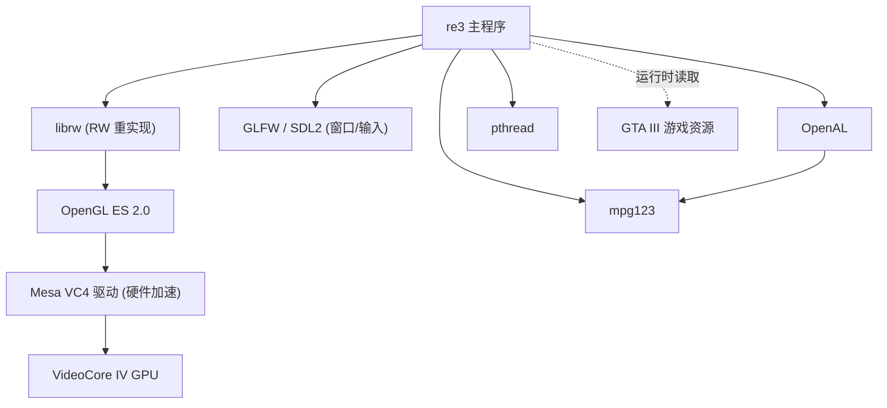
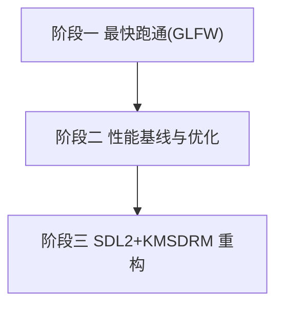

# 01 - 现状分析与移植计划

> re3（GTA III 逆向工程源码）移植到树莓派 Zero 2 W 的现状梳理、环境记录与工作计划。

## 1. 项目本质

re3 是 GTA III 的完全逆向 C++ 源码工程。

- 遵循 C++11 之前标准（`CODING_STYLE.md` 禁止 C++11+ 特性），对老工具链友好。
- **不含游戏资源**，运行时必须依赖用户自有的正版 GTA III 资源（models / data / audio / txd）。
- 渲染通过 `librw`（RenderWare 开源重实现，vendor 子模块），支持 D3D9 / OpenGL 2.1+ / **OpenGL ES 2.0+**。
- 音频通过 OpenAL（跨平台）或 MSS（仅 Windows）。
- README 官方声明支持 arm/arm64，To-Do 点名"树莓派 OpenGL 层性能待优化"。

## 2. 目标硬件

| 项目 | 规格 |
|---|---|
| 设备 | Raspberry Pi Zero 2 W Rev 1.0 |
| CPU | 4× Cortex-A53 @ 1.0 GHz（armv7l） |
| GPU | VideoCore IV（OpenGL ES 2.0） |
| 内存 | 512 MB（可用约 220 MB） |
| 系统 | Raspbian 13 (trixie), 32-bit armhf, 内核 6.18 |
| 地址 | `<PI_HOST>`（局域网 IP，按实际填写） |

## 3. 依赖关系



## 4. GPU 驱动现状（关键澄清）

树莓派有两套 GLES 驱动栈：

| 驱动栈 | 类型 | 现状 |
|---|---|---|
| 旧 Broadcom `/opt/vc` + Dispmanx | 闭源固件接口 | trixie 已弃用移除 |
| **Mesa VC4 (DRM-KMS)** | **开源硬件驱动** | **当前默认，本项目采用** |

- **Mesa ≠ 软件渲染**：Mesa 是驱动框架，VC4 是操控硬件的驱动，llvmpipe 才是 CPU 软件后端。
- **必须用 32 位 armhf**：VC4 在 ARM64 对 Pi3 系不可用，64 位会退回 llvmpipe。本机已符合。

## 5. GPU 性能实测

`glmark2-es2-drm` 实测确认硬件渲染：

```
GL_RENDERER: VC4 V3D 2.1   (硬件，非 llvmpipe)
GL_VERSION:  OpenGL ES 2.0 Mesa 25.0.7
Surface:     1920x1080 fullscreen
```

关键基准（1080p）：

| 类别 | 代表项 | FPS | 含义 |
|---|---|---|---|
| 顶点/几何 | build / conditionals(vtx) | 204 / 219 | 强 |
| 简单纹理填充 | texture | ~200 | 良好 |
| 片元复杂度 | conditionals(frag=5) | 121 | 一复杂即掉半 |
| 多采样 | effect2d 卷积 | 41 | 暴跌 |
| 依赖纹理读取 | refract | 13 | 杀手 |
| 高 overdraw | terrain | 3 | 填充率瓶颈 |

**规律**：片元变复杂 / overdraw / 依赖性纹理读取 → 帧率断崖下跌。

## 6. 与 PS2 对比

| 指标 | PS2 (GS) | Zero 2 W (VC4) | 强者 |
|---|---|---|---|
| 像素填充率 | ~2.35 GPixel/s | ~1 GPixel/s | PS2 |
| 显存带宽 | 4MB eDRAM ~48GB/s | 共享内存，低 | PS2 |
| 着色算力 | VU ~6 GFLOPS | QPU ~28–38 GFLOPS | Pi |
| 内存 | 32 MB | 512 MB | Pi |
| CPU | 294MHz EE | 4×1GHz A53 | Pi |

> 数据为理论峰值/规格，非同一基准实测，仅作数量级参考。

**结论：强弱项错位。** PS2 强在填充率+带宽（GTA III 正照此设计），Zero 2 W 强在算力+内存+CPU。GTA III 真正负担是 overdraw 而非片元复杂度。

**性能目标**：对标 PS2 版 —— 480p 或更低 / 锁 30fps / 拉近雾 + 关增强特效。优化主战场是省填充率、省带宽。

## 7. 环境搭建记录

### 7.1 主机（x86_64 Ubuntu 24.04）

```bash
# 交叉工具链 (arm-linux-gnueabihf-gcc/g++ 13.3)
sudo apt-get install -y crossbuild-essential-armhf

# 从树莓派同步 sysroot
mkdir -p rpi-sysroot/usr/include rpi-sysroot/usr/lib
rsync -az --rsync-path="sudo rsync" pi@<PI_HOST>:/usr/include/ rpi-sysroot/usr/include/
rsync -az --rsync-path="sudo rsync" pi@<PI_HOST>:/usr/lib/ rpi-sysroot/usr/lib/
ln -sfn usr/lib rpi-sysroot/lib   # usr-merge，解决 libc.so 链接脚本绝对路径
```

> `gcc-arm-none-eabi` 是裸机工具链，不能用于 Linux 用户态程序。

### 7.2 树莓派侧

```bash
sudo apt-get install -y libopenal-dev libmpg123-dev libglfw3-dev
# SDL2/EGL/GLES/GBM/DRM 的 dev 系统已自带；装完需重新同步 sysroot
```

### 7.3 CMake 工具链文件

见根目录 `rpi-armhf-toolchain.cmake`。要点：sysroot 指向、CPU 调优 `-march=armv7-a -mfpu=neon-vfpv4 -mfloat-abi=hard -mtune=cortex-a53`、`-Wl,-rpath-link`、pkg-config 指向 sysroot。

### 7.4 配置与编译

```bash
cmake -S . -B build-rpi -G Ninja \
  -DCMAKE_TOOLCHAIN_FILE=$(pwd)/rpi-armhf-toolchain.cmake \
  -DCMAKE_BUILD_TYPE=Release -DRE3_AUDIO=OAL \
  -DRE3_VENDORED_LIBRW=ON -DLIBRW_PLATFORM=GL3 -DLIBRW_GL3_GFXLIB=GLFW \
  -DLIBRW_TOOLS=OFF -DLIBRW_INSTALL=OFF
cmake --build build-rpi -j$(nproc)
```

## 8. Shader 优化方向（阶段二备用）

librw 的 GLES2 shader（`vendor/librw/src/gl/shaders/`）由作者手写（非逆向）。树莓派走 `shaderDecl100es`（`gl3device.cpp`），全局 `precision highp`。

| 优化点 | 说明 | 印证基准 |
|---|---|---|
| ① highp→mediump | 片元默认精度降级，VC4 上吞吐约翻倍 | frag=5 掉到121 |
| ② 消除依赖纹理读取 | `simple.frag` 的 `1.0-v_tex0.y` 移到顶点 | refract 仅13 |
| ③ 短路空光照循环 | `DoDynamicLight` 默认空转 | — |
| ④ discard 仅必要材质 | 已有 NO_ALPHATEST 变体，确认不透明走 noAT | tiler early-Z |

> 改 `.vert/.frag` 后必须用 Makefile 重新生成 `.inc`。

## 9. 工作计划与进度



### 阶段一：最快跑通（GLFW，零改动）

| # | 任务 | 状态 |
|---|---|---|
| 1.1 | 主机装交叉工具链 | ✅ |
| 1.2 | 同步 sysroot | ✅ |
| 1.3 | CMake toolchain 文件 | ✅ |
| 1.4 | 工具链冒烟测试 | ✅ |
| 1.5 | 树莓派装 GLFW dev + 重同步 | ⬜ 进行中 |
| 1.6 | GLFW 配置并交叉编译 | ⬜ |
| 1.7 | 部署二进制+资源到树莓派 | ⬜ |
| 1.8 | 运行验证画面/音频/资源 | ⬜ |

### 阶段二：性能基线与优化

| # | 任务 | 状态 |
|---|---|---|
| 2.1 | 原始 fps 基线 | ⬜ |
| 2.2 | 降分辨率 480p | ⬜ |
| 2.3 | config.h 拉近雾/关增强特效 | ⬜ |
| 2.4 | Shader mediump | ⬜ |
| 2.5 | 消除依赖纹理读取 | ⬜ |

### 阶段三：SDL2 + KMSDRM 重构

| # | 任务 | 状态 |
|---|---|---|
| 3.1 | 编写 `src/skel/sdl2/sdl2.cpp` | ⬜ |
| 3.2 | ps* 接口 + 事件循环 + 输入映射 | ⬜ |
| 3.3 | CMake 支持 SDL2 路径 | ⬜ |
| 3.4 | 脱离桌面全屏(KMSDRM) | ⬜ |
| 3.5 | GLFW vs SDL2 A/B 对比 | ⬜ |

## 10. 关键决策与已知问题

| 项 | 结论/对策 |
|---|---|
| 系统位数 | 32位 armhf（VC4 在 ARM64 对 Pi3 不可用） |
| 编译方式 | 主机交叉编译（Zero 2 W 本地编译慢易 OOM） |
| 窗口层 | 阶段一 GLFW（零改动），阶段三 SDL2+KMSDRM |
| 首次编译报 `GLFWwindow` 错误 | 根因：re3 无 SDL2 skeleton，librw 却用 SDL2；阶段一改回 GLFW |
| 内存 512MB | 交叉编译规避 OOM；运行期控制特性 |
| GPU 填充率弱 | 降分辨率+拉近雾+shader 优化 |
