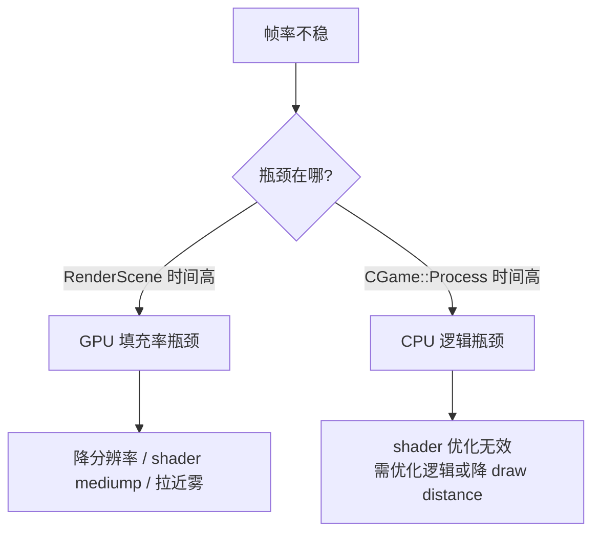
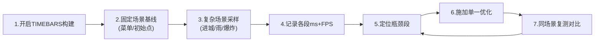

# 03 - 性能分析与 Profiler 方案

> 目标：在改任何 shader / 配置之前，建立可量化的性能测量手段，区分掉帧是 CPU 逻辑瓶颈还是 GPU 填充率瓶颈，避免盲目优化。

## 1. 核心原则

**先测量，再优化，用数据验证。** 帧率不稳的原因必须先定位：



## 2. re3 内置 Profiler（首选，零外部依赖）

re3 自带 **TIMEBARS** profiler，能在屏幕上实时显示 FPS 和每帧各阶段耗时。

### 2.1 启用方式

- 定义在 `src/core/timebars.cpp`，受 `TIMEBARS` 宏控制（`src/core/timebars.h`）。
- 仅在**非 MASTER、非 FINAL** 构建下显示 timer 明细（见 timebars.cpp 的 `#ifndef FINAL`）。
- FPS 显示本身在 `tbDisplay()` 中，`Diag_GetFPS()` 计算。

需要在构建中定义 `TIMEBARS` 宏。建议纳入 `RE3_RPI` 相关的调试配置（见第 6 节）。

### 2.2 测量的阶段（`src/core/main.cpp`）

timebar 把每帧分解为以下段，正好能区分 CPU / GPU：

| 阶段 | 类别 | 含义 |
|---|---|---|
| `CGame::Process` | **CPU** | 物理、AI、碰撞、任务脚本 |
| `DMAudio.Service` | CPU | 音频调度 |
| `CnstrRenderList` | CPU | 构建渲染列表（可见性剔除等） |
| `PreRender` | CPU/GPU | 渲染预处理 |
| `RenderScene` | **GPU** | 3D 场景绘制（**填充率大头**） |
| `RenderMotionBlur` | GPU | 运动模糊后处理 |
| `Render2dStuff` | GPU | HUD / 2D |
| `RenderMenus` | GPU | 菜单 |
| `DoFade` / `Render2dStuff-Fade` | GPU | 淡入淡出 |

**判读方法**：
- `RenderScene` 随场景复杂度（进城、雨天、爆炸）飙升 → **填充率瓶颈**，shader/降分辨率有效。
- `CGame::Process` 高而 `RenderScene` 平稳 → CPU 瓶颈，改 shader 无效。

### 2.3 重要注意：GLES 异步性

GLES 的绘制调用是**异步**的——`RenderScene` 计时只覆盖"提交命令"的 CPU 时间，真正的 GPU 执行可能延迟到 `SwapBuffers`（帧末）才阻塞完成。因此：

- timebar 的 `RenderScene` 可能**低估** GPU 实际负载。
- 若 `Frame Time`（总帧时间，timebars.cpp 的 `FRAMETIME`）明显大于各段之和，差值往往就是 **GPU 在 SwapBuffers 处的等待**——这本身就是 GPU 瓶颈的强信号。
- 关闭 vsync（避免 SwapBuffers 等垂直同步）可让测量更纯粹，见第 4 节。

## 3. 关键量化指标

| 指标 | 来源 | 用途 |
|---|---|---|
| FPS | timebar `Diag_GetFPS()` | 总体帧率 |
| Frame Time | timebar `FRAMETIME` | 每帧总耗时 |
| RenderScene ms | timebar | GPU 填充负载 |
| CGame::Process ms | timebar | CPU 逻辑负载 |
| 进程 RSS | `ps -C re3 -o rss=` | 进程内存 |
| 系统可用内存 | `free -m` | 显存/CMA 压力（高画质下关键） |

## 4. 外部/补充手段

### 4.1 关闭 vsync 测真实上限

vsync 会把帧率锁在 60fps 并在 SwapBuffers 阻塞，掩盖真实性能。测量时关掉：
- librw 的 `rasterShow` 中 `SDL_GL_SetSwapInterval` / `glfwSwapInterval`（受 `FLIPWAITVSYNCH` 控制）。
- re3 侧菜单帧率限制 / `CFrontEndMenuManager` 的 FrameLimiter。

### 4.2 系统级观测

```bash
# CPU 占用与频率（是否 CPU 满载/降频）
top -b -n1 | head; vcgencmd measure_clock arm; vcgencmd measure_temp

# GPU 显存 (CMA) 压力
cat /proc/meminfo | grep -i cma

# 是否触发 swap 抖动
vmstat 1 5
```

### 4.3 内存时间线采样（已用于阶段一）

后台采样脚本，记录进程 RSS 峰值与系统可用内存随时间变化，用于交互测试期间监测。

## 5. 标准测量流程



**每次只改一个变量**（分辨率 / mediump / 雾距 / 某个 shader），同场景前后对比，才能归因。

## 6. 脱离桌面探索结论

尝试脱离桌面运行以省内存（~80-100MB）和去合成器开销，结果：

| 方案 | 结果 | 障碍 |
|---|---|---|
| SSH 起纯 Xorg (`xinit ... vt1`) | ❌ 失败 | `xf86OpenConsole: Switching VT failed`——SSH 会话无控制 TTY |
| 物理 TTY `startx` | ⚠️ 未试 | 需树莓派本地键盘或 autologin |
| `cage`/`weston` 极简 Wayland | ⚠️ 未装 | GLFW 3.4 含 Wayland 后端（73 符号），可行但需安装 |
| **KMSDRM 直接渲染** | ✅ 最优 | 需 SDL2 skeleton（阶段三），**不依赖 X/Wayland/VT** |

**结论**：从 SSH 干净脱离桌面受 VT 限制。真正彻底的方案是 **KMSDRM（SDL2 路线）**，它直接抓 `/dev/dri`，无需任何显示服务器。这与 **SPI 屏方案（必须离屏渲染）** 的技术需求完全一致——因此阶段三的 SDL2+KMSDRM 是"脱离桌面 + SPI 屏 + 省内存"的共同基础。

> 短期：继续在 HDMI + 桌面(XWayland) 下用 timebar 做性能优化。
> 中期：SDL2+KMSDRM 脱离桌面。

## 7. 待办

- [ ] 在构建中启用 `TIMEBARS`，重新部署，屏幕确认 FPS/各段耗时可见。
- [ ] 采集基线：菜单、初始出生点、进城、雨天各场景的 FPS + RenderScene/CGame::Process ms。
- [ ] 据基线确认主瓶颈（预期为 RenderScene 填充率），再进入 shader/分辨率优化。
