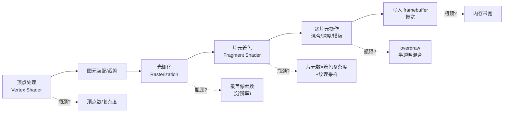

# 04 - GPU 瓶颈深度分析

> 目标：在确认瓶颈是 GPU（文档 03）之后，进一步定位 GPU 管线的**哪个阶段**慢，为有效优化提供依据。附 shader 编译/缓存机制说明，以及 mediump 优化的负面结果记录。

## 1. GPU 管线阶段与可能的瓶颈

GLES2 光栅化管线，每一环都可能成为瓶颈：



### VideoCore IV (VC4) 的特性

- **Tile-Based Deferred Rendering (TBDR)**：屏幕分成 tile（VC4 为 64×64 或类似），逐 tile 渲染，减少带宽。
- **弱项**：像素填充率、纹理带宽、共享内存带宽。
- **强项**：顶点/QPU 算力（~24-38 GFLOPS）。

## 2. 各阶段的判定方法（受控实验法）

**核心思想**：没有现成 GPU profiler 时，通过**改变单一变量**观察 FPS 变化来隔离瓶颈。这是本项目最可靠的手段。

| 怀疑阶段 | 实验 | 若是该瓶颈的现象 |
|---|---|---|
| **光栅化/填充率** | 降低分辨率（如 640×480→320×240） | FPS 大幅提升（近似像素数反比） |
| **片元着色复杂度** | 简化片元 shader（去 fog/采样） | FPS 提升 |
| **overdraw/混合** | 关闭半透明/粒子/近雾 | 高 overdraw 场景 FPS 提升 |
| **顶点处理** | 降低 draw distance（少几何） | FPS 提升但降分辨率无效 |
| **纹理带宽** | 降低纹理分辨率/用压缩纹理 | FPS 提升 |

**关键区分**：
- **降分辨率有效 + 降 draw distance 无效** → 填充率/片元/带宽瓶颈（像素相关）
- **降 draw distance 有效 + 降分辨率无效** → 顶点/几何瓶颈（顶点相关）

已知（文档 03）：GTA III 空场景 233fps、烟雾场景 12fps，几何量相近但 overdraw 差异大 → **强烈指向 overdraw + 填充率/带宽**，而非顶点。

## 3. GL_EXT_disjoint_timer_query（GPU 端计时）

GLES2 上测量 GPU 真实耗时的标准手段（区别于 CPU 提交时间）：

```c
// 需要扩展 GL_EXT_disjoint_timer_query
glGenQueriesEXT(1, &q);
glBeginQueryEXT(GL_TIME_ELAPSED_EXT, q);
//  ... 一段 GPU 命令 ...
glEndQueryEXT(GL_TIME_ELAPSED_EXT);
// 之后（不要立即）读取：
glGetQueryObjectui64vEXT(q, GL_QUERY_RESULT_EXT, &nanoseconds);
```

- 能测出**某段绘制在 GPU 上真实花了多少纳秒**，弥补 timebar 只测 CPU 提交时间的缺陷（文档 03 的 GLES 异步性问题）。
- **待确认**：VC4 是否支持 `GL_EXT_disjoint_timer_query`（运行时 `glGetString(GL_EXTENSIONS)` 检查）。若支持，可在 librw 的 RenderScene 前后插入 query，直接量化 GPU 时间。
- 若不支持，退回受控实验法。

## 4. VC4 特定的底层手段

树莓派实测可用：

| 手段 | 路径/方式 | 用途 |
|---|---|---|
| VC4 debugfs | `/sys/kernel/debug/dri/soc:gpu/` | `bo_stats`(显存对象)、`v3d_regs`、`hvs_*`(显示层)、`gem_names` |
| VC4 perfmon | DRM ioctl `DRM_IOCTL_VC4_PERFMON_*` | 硬件性能计数器（需编程调用，无现成 CLI） |
| Mesa 调试 | 环境变量 `VC4_DEBUG=perf` | 打印性能警告（如 shader 重编、非最优路径） |

> 未安装：apitrace / renderdoc / perf。如需帧级 API 追踪可后续安装 apitrace。

**`VC4_DEBUG=perf` 值得一试**：设此环境变量运行，Mesa 会在 stderr 打印性能相关警告，可能直接指出瓶颈（如带宽、tile 溢出）。

## 5. Shader 编译与缓存机制

**librw 无 shader 缓存**：

- `gl3shader.cpp` 每次启动都 `glShaderSource` + `glCompileShader` 从内嵌 GLSL 源码字符串重新编译。
- `glProgramBinary`/`glGetProgramBinary`（二进制缓存 API）在 glad 中有声明，但 **librw 未调用**——不落盘。
- `.inc` 文件由 `.vert/.frag` 经 Makefile 的 sed 生成并编入二进制。**改 shader 必须重新 `make` 生成 `.inc`，否则改动不生效**。

**Mesa 隐式缓存**：

- Mesa 有 `~/.cache/mesa_shader_cache`，缓存编译结果。相同源码第二次编译更快。
- **改 shader 源码 → 字符串变化 → Mesa cache miss → 真正重编**。所以改动一定生效，不会被缓存吃掉。
- 若要测 shader 编译耗时，先清 `~/.cache/mesa_shader_cache`。
- 本机首次探测时 `~/.cache/mesa_shader_cache` 尚未生成（可能因运行环境或路径差异）。

## 6. 优化实验记录

### 6.1 片元 mediump —— 负面结果（已回退）

**假设**（文档 03 曾列为"收益最大"）：把片元 shader 从 highp 降 mediump，VC4 片元吞吐约翻倍。

**实现**：`shaderDecl100es` 加 `RW_FRAG_MEDIUMP`，`header.frag` 在该宏下 `precision mediump float`（顶点保持 highp）。

**结果（同场景对比基线）**：

| 指标 | 基线 | mediump | 变化 |
|---|---|---|---|
| FPS avg | 33.3 | 33.2 | 无 |
| FPS min | 12.2 | 11.4 | 无（噪声内） |
| FPS max | 233.5 | 236.4 | 无 |

**结论**：**mediump 无效，已回退。**

**原因分析**：GTA III 的片元 shader 极简单（纹理采样 + fog 混合 + alpha test），**片元 ALU 运算量本就很小**，不是瓶颈。mediump 加速的是 ALU 吞吐，而真正的瓶颈是 **overdraw + 光栅化/带宽**（同一像素被反复绘制、纹理采样带宽），mediump 不改变这些。

**修正认知**：这推翻了"片元计算是瓶颈"的假设，进一步确认瓶颈是 **overdraw + 填充率/带宽**本身。

### 6.2 discard / alpha-test 分派 —— 排查后确认无问题

**假设**：`DoAlphaTest` 用 `discard`，在 tile-based 的 VC4 上会关闭 early-Z。若不透明物体错误地走了带 `discard` 的 shader，会白白损失填充率。

**方法**：临时插桩（`RPI_AT_STATS`），统计每帧走 alpha-test（discard）vs no-alpha-test 的 draw call 数。

**实测（游戏内）**：

| 场景 | FPS | AT draws | noAT draws | AT% |
|---|---|---|---|---|
| 流畅 | 31.9 | 36 | 278 | 11% |
| 掉帧 | 13.6 | 46 | 150 | 23% |
| 中等 | 18.0 | 25 | 157 | 14% |

**结论**：**分派逻辑正确，无浪费**。
- 大部分 draw call（77-89%）走 noAT（无 discard），不透明物体未错误吃 discard 惩罚。
- 掉帧帧 AT% 升高（23%）是**结果而非原因**：复杂场景本就有更多需 alpha-test 的物体（植被/栅栏/烟雾边缘）。
- AT draw call 绝对数量不大（25-46）。

**这不是可"免费修复"的 bug。已移除插桩。**

### 6.3 shader 层排查总结

shader 极简单（`simple.frag` 仅 3 行有效计算），且两个 shader 层假设均被实测排除（mediump 无效、discard 分派正常）。**shader 代码本身无可优化的浪费点**。瓶颈完全在 shader 之外：overdraw + 填充率 + 带宽。→ 只能靠**降像素量（分辨率）/ 降带宽（16bpp）/ 降 overdraw（近雾、减粒子）**。

## 7. 据此修正的优化优先级

| 优先级 | 优化 | 依据 |
|---|---|---|
| 1 | **降分辨率** | 直接砍光栅化/填充/带宽，对像素相关瓶颈最确定有效 |
| 2 | **减少 overdraw**：拉近雾、减少粒子/半透明层数 | 烟雾场景 12fps 的直接成因 |
| 3 | 消除依赖性纹理读取（`simple.frag` 的 `1.0-v_tex0.y` 移到顶点） | 减少纹理采样延迟 |
| ~~4~~ | ~~片元 mediump~~ | ❌ 实测无效，已放弃 |

## 8. 显存 (CMA) 分析

树莓派无独立显存，GPU 使用 **CMA（连续内存分配器）**——从 512MB 系统内存中预留一块给 GPU。

**配置**：`CmaTotal = 256MB`（`cma-reserved`，内核启动时预留）。`gpu_mem=64M`（旧固件路径，KMS 下主要看 CMA）。

**实测（640×480，游戏内）**：

| 状态 | CmaFree | 说明 |
|---|---|---|
| re3 未运行 | ~139 MB | 基线 |
| **re3 游戏内** | **~14 MB** | **临界！占用约 125MB** |

GPU buffer 占用明细（`bo_stats`）：V3D BOs 59.9MB + binner 16.4MB + dumb/cache ~21MB。

**结论**：
- CMA 处于**临界状态**（仅剩 14MB），但 dmesg **无分配失败**，故不是硬崩溃成因。
- 余量极小 → 复杂场景纹理流入时易触发**换入换出**，这可能是**帧率不稳定（尖峰卡顿）的独立成因**，区别于填充率导致的持续低帧。
- **降分辨率同时缓解**：framebuffer/渲染目标占 CMA，降分辨率既省填充率带宽，又省 CMA。**一箭双雕**。

**判定显存瓶颈的方法**：
- `grep CmaFree /proc/meminfo`（运行时对比空闲量）
- `sudo cat /sys/kernel/debug/dri/soc:gpu/bo_stats`（GPU buffer 明细）
- `sudo dmesg | grep -i cma`（分配失败/回收）
- 增大 CMA：`config.txt` 的 `dtoverlay=vc4-kms-v3d,cma-XXX` 或内核 cmdline `cma=320M`（代价：挤占系统内存）

### Mesa 调试尝试

`VC4_DEBUG=perf` + `MESA_DEBUG=1` 运行**未产出有用的性能警告**（可能因 renderer 为 V3D 路径、或 Mesa 非 debug 构建、或环境变量未透传）。后续可试 `V3D_DEBUG=perf`。此路暂无产出，改用受控实验法。

## 9. 全屏后处理拷贝分析（关键发现）

`CPostFX::GetBackBuffer`（`RwRasterRenderFast`）会把**整个屏幕拷贝到纹理**，是带宽杀手。触发它的效果：

| 效果 | 触发全屏拷贝 | 开关 | 原版有 |
|---|---|---|---|
| **屏幕雨滴 (SCREEN_DROPLETS)** | ✅ 拷贝 + 全屏后处理（双重） | `config.h` | ❌ Xbox 移植 |
| **colourfilter (POSTFX_NORMAL)** | ✅ 非 mblur 时每帧拷贝（常驻！） | 菜单 EffectSwitch | 部分 |
| PostFX MOBILE | ✅ 总拷贝 | EffectSwitch | 手机版 |
| Motion Blur (Trails) | 用 frontbuffer 拷贝 | `[Graphics] Trails` | PS2 有 |
| PostFX SIMPLE/OFF | ❌ 不拷贝 | — | — |

**下雨掉帧真凶**：SCREEN_DROPLETS 下雨时激活 → 每帧全屏 backbuffer 拷贝 + 全屏雨滴后处理。这是 VC4（带宽受限）的巨大开销，远重于 35 条雨丝。

## 10. 优化实测结果

| 优化 | 效果 | 状态 |
|---|---|---|
| RPI_PREFER_GLES（硬件 GLES2） | 软件渲染 → 硬件 | ✅ 基础 |
| **16bpp (RGB565 + 16-bit depth)** | **avg +11%** (33.3→36.9) | ✅ 保留 |
| **关屏幕雨滴 (RPI_LEAN_FX)** | **下雨 12→20+fps** | ✅ 保留 |
| mediump 片元精度 | 0%（片元 ALU 非瓶颈） | ❌ 已弃 |
| discard 分派 | 无问题（noAT 占 77-89%） | — 非优化点 |

**16bpp + LEAN_FX 累积**（213 样本，3 分钟）：avg 75.1 / min 15.5 / max 256.6fps（avg 含场景采样偏差，但 **min 12.2→15.5 是实打实改善**）。

**关于"下雨卡死"**：**非必现**。3 分钟监控进程全程 RLl（正常），下雨降到 15-22fps 但不卡死。此前一次"卡死"是**偶发 IO 尖峰**（CMA 临界 13MB 时纹理换入换出撞上资源加载），非稳定问题。

## 11. 下一步

- [ ] **colourfilter (POSTFX)**：常驻的全屏拷贝，降级到 SIMPLE（不拷贝）可能提升**非雨天平均帧率**。先经菜单验证。
- [ ] 受控实验：拉近雾/减粒子，测复杂场景。
- [ ] 缓解 CMA 临界（增大 cma 或降分辨率）以消除偶发 IO 尖峰。
