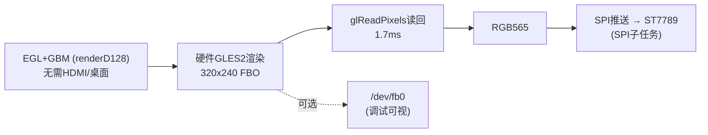

# 07 - 脱离桌面离屏渲染验证（SPI 屏方案基石）

> 验证 re3 能否脱离桌面、脱离 HDMI，用 EGL+GBM 拿硬件 GLES 上下文渲染，为 SPI 屏移植奠定基础。**结论：完全可行。**

## 1. 背景

- 现有 re3 走 **GLFW**，必须有 X11/Wayland 桌面（停桌面 → `glfwInit failed`）。
- SPI 屏场景：无 HDMI、无桌面，GPU 渲染到内存后经 SPI 推到 ST7789。
- 需验证：**EGL+GBM 能否脱离桌面/HDMI 拿到硬件 GLES 上下文**。

## 2. 验证程序

`spike/egl_fb_test.c`：EGL+GBM（renderD128）→ 硬件 GLES2 渲染 320×240 离屏 FBO → glReadPixels 读回 → RGB565 转换 →（可选）写 /dev/fb0。测量各步耗时。

交叉编译：
```bash
arm-linux-gnueabihf-gcc --sysroot=$SR -O2 spike/egl_fb_test.c -o egl_fb_test \
  -I$SR/usr/include -L$SR/usr/lib/arm-linux-gnueabihf \
  -Wl,-rpath-link,$SR/usr/lib/arm-linux-gnueabihf -lgbm -lEGL -lGLESv2
```

运行（停桌面）：`sudo ./egl_fb_test 120`

## 3. DRM 节点角色（关键）

| 节点 | 组 | 角色 | 依赖 HDMI |
|---|---|---|---|
| `/dev/dri/renderD128` | render | **纯渲染节点**（GPU 计算） | ❌ 不依赖 |
| `/dev/dri/card0` | video | 显示节点（KMS/CRTC/connector） | ✅ 绑 HDMI |
| `/dev/fb0` (vc4drmfb) | — | KMS framebuffer | 绑 card0 |

**EGL+GBM 用 renderD128 → 纯 GPU 计算，与显示器无关。**

## 4. 实测结果（每帧 avg，320×240）

| 步骤 | 有 HDMI | **无 HDMI** | 说明 |
|---|---|---|---|
| render + glFinish | 0.98ms | **0.48ms** | 无显示扫描竞争，更快 |
| glReadPixels | 2.14ms | **1.69ms** | 读回带宽更充裕 |
| RGB565 转换 | 0.23ms | 0.21ms | CPU 转换（可省，见下） |
| fb0 blit | 0.15ms | 0.14ms | memcpy |
| **合计** | 3.50ms (286fps) | **2.53ms (395fps)** | — |

渲染器：`VC4 V3D 2.1` (OpenGL ES 2.0 Mesa 25.0.7)，两种情况一致。

## 5. 决定性结论

1. **EGL+GBM 硬件 GLES 完全不依赖 HDMI/桌面** ✅ —— 拔掉 HDMI，`VC4 V3D 2.1` 照常，渲染+读回正常。**SPI 屏方案成立。**
2. **无 HDMI 反而更快**（286→395fps）—— GPU 不用驱动 1080p 显示扫描，资源更纯粹。
3. **fb0 拔 HDMI 后仍存在**（vc4 保留 framebuffer），但 **SPI 方案不需要 fb0**，读回像素直接推 SPI。
4. **GPU 余量巨大**：渲染+读回仅 2.5ms（395fps），而 SPI 推 320×240@60fps 需 ~16ms —— **瓶颈在 SPI，GPU 有 6 倍余量**。



## 6. 对 re3 集成的启示

- re3 需要一个 **EGL+GBM skeleton** 替代 GLFW（脱离桌面）。
- 渲染分辨率直接设 SPI 屏尺寸（如 240×240），既省 GPU 填充率（docs/04）又省 SPI 传输。
- **可优化点**：直接渲染 RGB565 FBO，省掉 CPU 的 RGBA→565 转换（0.2ms）；或用 `EGL_MESA_image_dma_buf_export` 零拷贝导出给 SPI。
- glReadPixels 1.7ms 不是瓶颈（SPI 推送慢得多）。

## 7. 下一步

- [ ] re3 集成 EGL+GBM skeleton（替代 GLFW），脱离桌面渲染。
- [ ] 与 SPI 推送（docs/06）对接：读回 → SPI → ST7789。
- [ ] 参考 `spike/egl_fb_test.c` 的 EGL+GBM 初始化代码。
