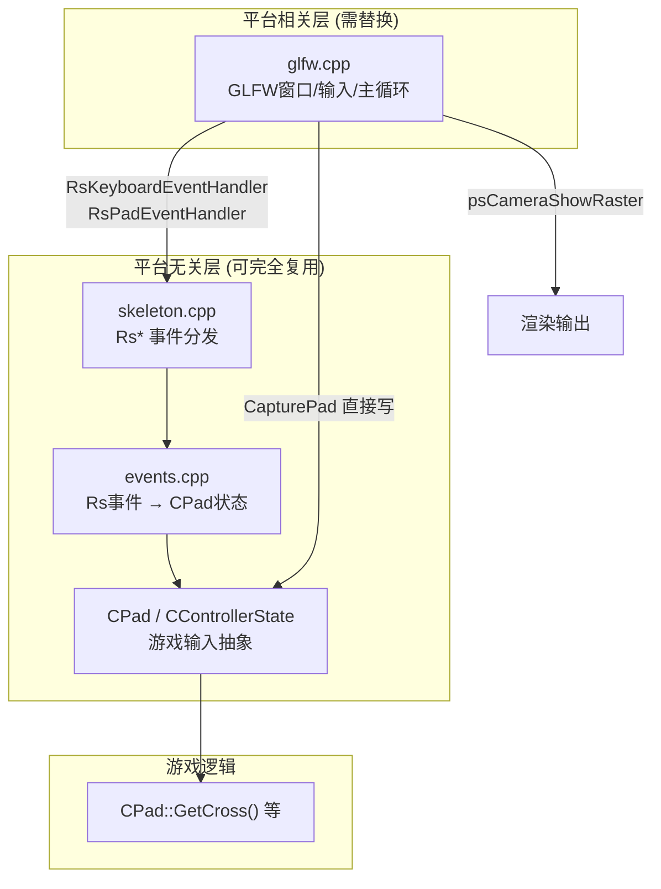
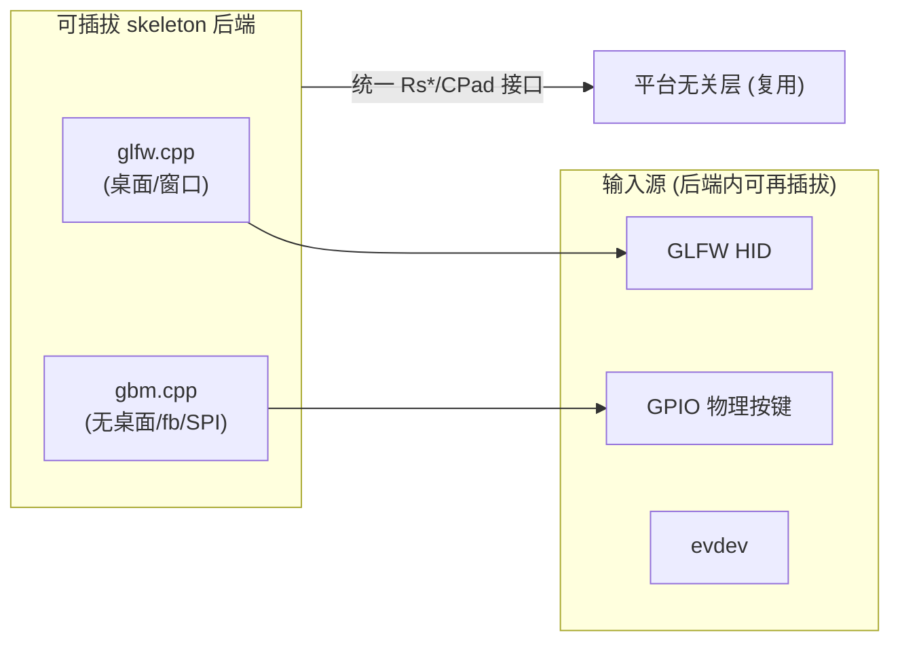
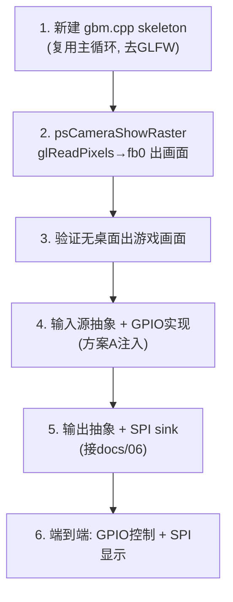

# 08 - 平台解耦方案（输入源 + 渲染输出可插拔）

> 目标：把 re3 的**渲染输出**（窗口 / GBM-fb / SPI）和**输入源**（GLFW / GPIO 物理按键 / …）都做成可插拔，支持树莓派无桌面 + GPIO 物理按键的嵌入式形态。

## 1. 现状：re3 其实已经天然分层

调查确认，re3 的 skeleton 已经是"平台无关事件层 + 平台相关实现层"的结构，解耦点清晰：



**关键结论**：`skeleton.cpp` / `events.cpp` / `CPad` **平台无关，全部复用**。只有 `glfw.cpp` 是平台相关的，解耦 = 替换 glfw.cpp 这一层。

## 2. 输入链路现状

### 2.1 键盘（两跳）
```
GLFW keypressCB → RsKeyboardEventHandler(rsKEYDOWN, &RsKeyCode)
  → events.cpp HandleKeyDown → CPad::TempKeyState.XXX = 255
  → CPad::UpdatePads: NewKeyState=TempKeyState + AffectPadFromKeyBoard → NewState
```

### 2.2 手柄（一跳，更直接）
```
CapturePad(padID) [glfw.cpp] → 读 GLFW joystick → 写 ControlsManager.m_NewState
  + pad->PCTempJoyState.LeftStickX 等 → CPad::UpdatePads → NewState
```

### 2.3 游戏读取
```cpp
CPad::GetPad(0)->GetCrossJustDown();   // NewState.Cross && !OldState.Cross
CPad::GetPad(0)->GetPedWalkLeftRight();
```

## 3. 输出链路现状

```
游戏渲染 → RwCameraShowRaster / psCameraShowRaster [glfw.cpp 行 221]
  → 当前硬编码 RwCameraShowRaster(camera, PSGLOBAL(window), ...)
```

`psCameraShowRaster` 是输出切入点。GBM 模式下无窗口，librw 的 GBM 后端 `showRaster` 已改为 glFinish（见 docs/07），输出（读回 + fb0/SPI）由 skeleton 负责。

## 4. 解耦架构设计

### 4.1 目标：skeleton 后端可插拔



**CMake 层面**：`LIBRW_GL3_GFXLIB` 已有 GLFW/SDL2/GBM，skeleton 按此选择编译 glfw.cpp 或 gbm.cpp。

### 4.2 新增 `src/skel/gbm/gbm.cpp`（GBM 后端 skeleton）

职责（对应 platform.h 接口）：
- `psInitialize/psTerminate`：平台数据、计时（clock_gettime，复用 glfw.cpp 的非 GLFW 部分）
- `main()`：引擎初始化 + 主循环（复制 glfw.cpp 的 gGameState 状态机，去掉 glfwPollEvents/glfwWindowShouldClose）
- `psCameraShowRaster`：渲染完成后 glReadPixels 读回 → RGB565 → 输出（fb0 或 SPI，见 docs/06/07）
- `psSelectDevice` / `_psSetVideoMode` / `_psGetVideoModeList`：GBM 单一模式（渲染分辨率）
- 输入：接入可插拔输入源（见 4.3）
- 文件系统/语言：复用平台无关实现

### 4.3 输入源抽象（关键：支持 GPIO 物理按键）

**设计一个最小输入源接口**，GBM skeleton 每帧调用：

```c
// src/skel/input/inputsource.h
struct InputSource {
    void (*init)(void);
    void (*poll)(void);      // 每帧调用：读硬件 → 注入 re3
    void (*terminate)(void);
};
extern InputSource *gInputSource;
```

**GPIO 物理按键实现** `src/skel/input/gpio_input.cpp`：
- `poll()` 里读 GPIO 引脚状态（libgpiod / sysfs / 直接 mmap）
- 每个物理按键映射到一个游戏动作，**注入方式二选一**（见第 5 节）

### 4.4 输出抽象

```c
// src/skel/output/outputsink.h
struct OutputSink {
    void (*init)(int w, int h);
    void (*present)(const void *rgba, int w, int h);  // 读回的帧 → 屏
    void (*terminate)(void);
};
```
- `fb0_sink`：写 /dev/fb0（调试/HDMI）
- `spi_sink`：推 ST7789（docs/06）

## 5. GPIO 输入注入方案（三选一，附推荐）

物理按键不是标准 HID，需要选一个注入点：

| 方案 | 注入点 | 优点 | 缺点 | 推荐 |
|---|---|---|---|---|
| **A. 手柄层** | GPIO → `PCTempJoyState`/ControlsManager（替代 CapturePad） | 一跳、模拟量友好、与 ControlsManager 兼容 | 需理解 ControlsManager 映射 | ⭐**推荐** |
| B. 键盘事件层 | GPIO → `RsKeyboardEventHandler(rsKEYDOWN, &code)` | 复用键盘全链路、改动小 | 需维护 GPIO→RsKeyCode 表、多一跳 | 可选 |
| C. 直接写 NewState | GPIO → `CPad::NewState.Cross` | 最简单 | 绕过 Old/NewState，"刚按下"检测失效，不兼容 ControlsManager | ❌ |

**推荐方案 A**：把 GPIO 按键当作一个"虚拟手柄"，在 GBM skeleton 的 `CapturePad` 等价物里，把 GPIO 引脚状态写进 `CPad::GetPad(0)->PCTempJoyState`（数字键→255/0，摇杆→-128~127）。这样 `CPad::UpdatePads` 的既有聚合逻辑不变，游戏逻辑零改动。

**GPIO→游戏动作映射示例**（物理按键少，映射到核心动作）：
```
GPIO_UP    → PCTempJoyState.DPadUp / LeftStickY
GPIO_DOWN  → DPadDown / LeftStickY
GPIO_LEFT/RIGHT → LeftStickX
GPIO_A     → Cross   (跳/确认)
GPIO_B     → Circle  (进车/取消)
GPIO_X     → Square  (开火)
GPIO_Y     → Triangle
GPIO_START → Start   (暂停/菜单)
GPIO_SELECT→ Select
```
菜单导航靠 DPad + Cross/Circle 即可，无需完整键盘。

## 6. 施工步骤



**第一步（最小可跑）**：gbm.cpp 只做"引擎初始化 + 主循环 + glReadPixels→fb0"，输入先空（或临时读键盘 evdev），验证无桌面能出游戏画面。这是当前的直接目标。

## 7. 已完成 / 待办

| 项 | 状态 |
|---|---|
| librw EGL+GBM 后端 | ✅ 已完成（docs/07，编译通过） |
| crossplatform.h psGlobalType GBM 分支 | ✅ |
| gbm.cpp skeleton（主循环 + fb0 输出） | ⬜ 核心待办 |
| 输入源抽象 + GPIO 注入（方案 A） | ⬜ |
| 输出抽象 + SPI sink | ⬜（接 docs/06 SPI 子任务） |

## 8. 关键设计原则

1. **平台无关层零改动**：skeleton.cpp / events.cpp / CPad 全复用，不碰。
2. **glfw.cpp 不动**：新增 gbm.cpp 并存，CMake 按 gfxlib 二选一编译，互不干扰。
3. **GPIO 走手柄层注入**（方案 A）：游戏逻辑和 ControlsManager 零感知。
4. **输出/输入各自抽象**：present sink 和 input source 独立可换，便于 fb0 调试 → SPI 生产平滑切换。
