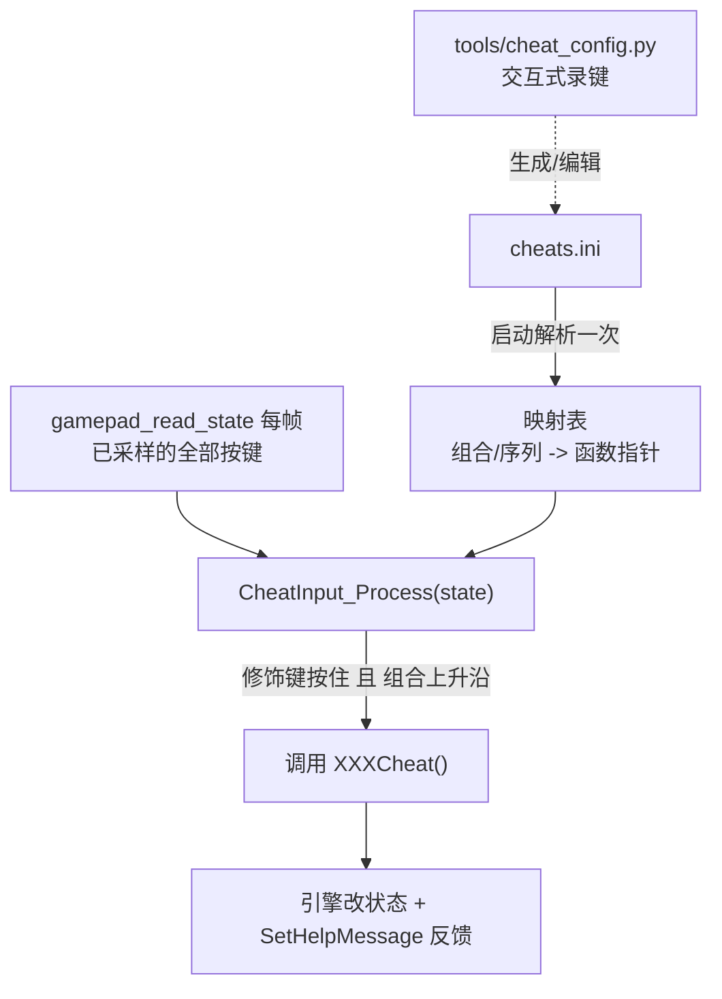

# 18 - 手柄作弊码快捷输入设计（PS5 手柄组合键 → 作弊码，配置文件驱动）

> 目标：用**标准 PS5（DualSense）手柄**的按键组合，快速触发 GTA III 的作弊码，
> 不用像 PC 版那样打一长串字母。映射关系放在**配置文件**里，并提供一个
> **交互式 Python 脚本**帮你「按一下手柄就录进去」地生成这份配置。改配置即可
> 增删、重绑，不用重编。
>
> 本文只做设计，不含实现代码。落地时按第 7 节的施工步骤走。

---

## 1. 现状调研（re3 已有的东西）

设计前先摸清 re3 的作弊码机制，避免重造轮子。

### 1.1 作弊码本体：一组全局函数

`src/core/Pad.cpp` 里每个作弊码就是一个**无参全局函数**，直接改游戏状态并弹一条
帮助提示。例如：

```cpp
void WeaponCheat();        // 给全套武器
void HealthCheat();        // 回满血
void ArmourCheat();        // 回满护甲
void MoneyCheat();         // +250000
void TankCheat();          // 刷坦克
void WantedLevelUpCheat(); // 通缉+2
void WantedLevelDownCheat();
void SunnyWeatherCheat();  // 各种天气
void FastTimeCheat();      // 时间流速
// ... 共约 25 个，见 Pad.cpp
```

**这些函数就是我们要触发的目标**，签名统一（`void f(void)`），非常适合做成一张
「名字 → 函数指针」的表。

### 1.2 已有先例：PS2 手柄字符序列（默认关闭）

`CPad::AddToCheatString(char c)`（`#ifdef GTA_PS2_STUFF`，默认不编译）已经实现过
「手柄按键 → 作弊」：把每次按下的键转成字符压入环形缓冲，再和一堆**写死的序列
字符串**比较（如 `"URDLURDL4144"` = R2 R2 L1 R2 … → `WeaponCheat`）。

**可借鉴**：按键→标记、缓冲匹配的思路。
**不满足需求**：序列写死不可配置、是逐键长序列（慢且易和正常操作冲突）、默认
`#ifdef` 掉。

### 1.3 输入链路：PS5 手柄走 evdev，每帧全量采样

本项目**不用 GPIO 物理按键**；标准 PS5 手柄通过内核 `hid-playstation` 驱动以
标准游戏手柄布局暴露在 `/dev/input/event*`，由 `src/skel/gbm/input_evdev.cpp`
读取。核心是 `gamepad_read_state(fd, s)`（被 `evdev_capturePad` **每帧**调用），
用 `EVIOCGKEY` / `EVIOCGABS` 同步采样整块手柄状态，映射进 `CControllerState`：

| 手柄键（DualSense） | evdev 码 | re3 CControllerState 字段 |
|---|---|---|
| ✕ / ○ / △ / □ | BTN_SOUTH/EAST/NORTH/WEST | Cross / Circle / Triangle / Square |
| L1 / R1 | BTN_TL / BTN_TR | LeftShoulder1 / RightShoulder1 |
| L2 / R2（模拟） | ABS_Z / ABS_RZ (0..255) | LeftShoulder2 / RightShoulder2 |
| L3 / R3（摇杆按下） | BTN_THUMBL / BTN_THUMBR | LeftShock / RightShock |
| Create / Options | BTN_SELECT / BTN_START | Select / Start |
| 方向键 | ABS_HAT0X/Y | DPadUp/Down/Left/Right |
| 左/右摇杆 | ABS_X/Y, ABS_RX/RY | LeftStick* / RightStick* |

**这就是检测组合键的天然挂载点**——每帧要的全部按键信息，`gamepad_read_state`
已经算好了。PS5 键位比 GPIO 丰富得多（多了独立 L2/R2、L3/R3、Create/Options），
组合空间充足。

---

## 2. 设计目标与取舍

| # | 目标 | 决定 |
|---|---|---|
| 1 | 用**组合键**而非长序列 | 组合键（修饰键 + 触发键）比逐键长串快、不易误触 |
| 2 | 映射放**配置文件** | 改文件即可增删/重绑，不重编 |
| 3 | 不与正常操作冲突 | 用一个游戏中不单独占用的键当「修饰键」，只有按住它时才解析组合 |
| 4 | 复用引擎已有作弊函数 | 建「名字 → 函数指针」表，配置用名字引用 |
| 5 | 配置**好生成** | 提供交互式 Python 脚本，按手柄录键，自动写配置 |
| 6 | 平台解耦、可关闭 | 逻辑放 evdev 输入源侧，编译期/运行期可关；桌面构建不受影响 |
| 7 | 有反馈 | 复用作弊函数自带的 `CHud::SetHelpMessage`，可加音效 |

### 2.1 修饰键的选择（PS5）

PS5 手柄上适合当「作弊修饰键」的候选：
- **L2（模拟扳机）**：徒步瞄准/开车常用，不宜。
- **Create（BTN_SELECT）**⭐：游戏内很少单独用，最适合当修饰键。**默认用它。**
- **L3/R3（按下摇杆）**：也少用，可作备选修饰键。
- 也支持**双修饰键**（如 `L1+R1` 同时按住）进一步降低误触。

按住修饰键时，其它键**临时进入作弊模式**：此时按一个短组合（如
`Create + L1 + R1 + △`）立即触发。松开修饰键即恢复正常操作。

---

## 3. 配置文件设计

### 3.1 位置与格式

- 路径：游戏目录下 `cheats.ini`（与 `re3.ini` 同级）。环境变量
  `RE3_CHEATS_FILE` 可覆盖路径。
- 格式：轻量行式 `键=值`，与现有 `re3.ini` 风格一致，**自己解析**（不引第三方
  库）。头部可放全局设置，其后每行一条映射：

```ini
# cheats.ini —— PS5 手柄作弊码映射（可由 tools/cheat_config.py 生成）
# 全局设置
modifier = CREATE          # 修饰键：CREATE / OPTIONS / L3 / R3 / L1+R1 ...

# 映射语法:  <组合键> = <作弊码名>
# 键名: CROSS CIRCLE TRIANGLE SQUARE  L1 R1 L2 R2  L3 R3
#       CREATE OPTIONS  UP DOWN LEFT RIGHT
# 组合键里可省略修饰键（每条自动带上 modifier），也可显式写别的临时修饰键。

L1+R1+TRIANGLE = weapons      # 全套武器
L1+R1+CROSS    = health       # 回满血
L1+R1+SQUARE   = armour       # 满护甲
L1+R1+CIRCLE   = money        # 加钱
UP+TRIANGLE    = wanted_up    # 通缉+2
DOWN+TRIANGLE  = wanted_down  # 清通缉
L2+R2+CROSS    = tank         # 刷坦克
SQUARE+CIRCLE  = sunny        # 晴天

# 可选：修饰键 + 短序列（按住修饰键依次按），用 ',' 表示先后：
# [DOWN,DOWN,UP] = some_cheat
```

### 3.2 语义规则

- **修饰键**：`modifier` 指定（默认 `CREATE`）。只有修饰键处于按住状态时才解析
  后面的组合/序列，从根本上避免误触。
- **组合键（`+`）**：这些键需在**同一帧同时按住**。用「上升沿」判定：从
  「未满足」变「满足」的那一帧触发一次，按住不重复触发。
- **序列（`,`）**：按住修饰键期间按配置顺序依次按下，**每一步本身是一个组合**
  （可含 `+`）。用「每步上升沿 + 进度推进 + 超时（2s 无推进则重置）」的状态机
  判定。**同一个键可跨步重复**（如 `CROSS,CROSS,UP`），这是重复按键的支持方式：
  单个组合内位掩码会去重，无法表达「按两次」，但拆成两步即可。整条序列全程要求
  修饰键按住。
- **组合是序列的特例**：无逗号的映射就是「长度为 1 的序列」，走同一套状态机。
- **模拟扳机 L2/R2**：作为「按下」判定时用阈值（value > 200 视为按下）。
- **冲突处理**：加载时对前缀互为子集的映射给告警；同一组合重复定义以最后一条
  为准。

---

## 4. 作弊码注册表（名字 → 函数）

新增一张表把配置里的名字解析成引擎函数指针：

```cpp
// 伪代码，落地在新文件 src/skel/gbm/cheat_input.cpp
struct CheatEntry {
	const char *name;   // 配置文件里用的名字
	void (*fn)(void);   // Pad.cpp 里的作弊函数
};

static const CheatEntry kCheats[] = {
	{ "weapons",     WeaponCheat            },
	{ "health",      HealthCheat            },
	{ "armour",      ArmourCheat            },
	{ "money",       MoneyCheat             },
	{ "tank",        TankCheat              },
	{ "wanted_up",   WantedLevelUpCheat     },
	{ "wanted_down", WantedLevelDownCheat   },
	{ "sunny",       SunnyWeatherCheat      },
	{ "cloudy",      CloudyWeatherCheat     },
	{ "rainy",       RainyWeatherCheat      },
	{ "foggy",       FoggyWeatherCheat      },
	{ "fasttime",    FastTimeCheat          },
	{ "slowtime",    SlowTimeCheat          },
	// ... 按需补齐 Pad.cpp 中其余作弊函数
};
```

> 这些函数在 `Pad.cpp` 目前多为文件内全局函数，落地时需在头文件里 `extern`
> 声明，见第 7 节。**这张表也是 Python 脚本的作弊名单来源**（见第 6 节，脚本从
> 同一份清单读取可选作弊，避免两边不同步——可把名字表抽到一个共享的
> `cheats.def` 或直接让脚本解析本表）。

---

## 5. 运行时结构



- **解析时机**：进程启动读一次 `cheats.ini`，缓存到内存表（参照
  `RE3_TIMER_SCALE` 的「只读一次」原则，不每帧读文件）。
- **检测时机**：在 `gamepad_read_state` 末尾（或 `evdev_capturePad` 内采样之后）
  调用 `CheatInput_Process(state)`，传入本帧手柄状态。函数内部维护上一帧状态做
  上升沿判定与序列缓冲。
- **只在游戏内生效**：菜单中（`FrontEndMenuManager.m_bMenuActive`）或过场时不
  解析，避免和菜单导航冲突（evdev 源已有 `inMenu` 判定可复用）。
- **注入点**：直接**调用作弊函数**（方案 A），不走 PS2 的字符序列层。作弊函数
  现成、无副作用依赖，直接调用最简单可控。

### 5.1 与正常手柄映射的兼容

- **单独按修饰键（Create）**：保持原语义（Select）。
- **修饰键 + 其它键**：进入作弊解析，此时**抑制**修饰键本身这一帧的正常注入，
  避免一边触发作弊一边触发 Select 功能。
- 做法：`CheatInput_Process` 返回「本帧是否处于作弊组合中」，`gamepad_read_state`
  据此决定是否清掉修饰键对应字段。

---

## 6. 交互式配置脚本 `tools/cheat_config.py`

一个命令行交互脚本，帮你「按手柄录键」地生成 / 编辑 `cheats.ini`，不用手写键名。

### 6.1 依赖与运行

- 纯 Python 3，读手柄用 **`evdev`** 库（`pip install evdev`）；无手柄时可退化到
  纯键盘选择模式（手动选键名，不录键）。
- **中英双语**：按系统 locale（`LANG`/`LC_ALL`）自动选中/英文提示，可用
  `--lang zh|en` 强制。
- 在**接了 PS5 手柄的那台机器**（通常就是树莓派）上运行；也可在开发机跑纯选择
  模式生成配置再拷过去。

```bash
pip install evdev
python3 tools/cheat_config.py                 # 交互式，读/写 ./cheats.ini
python3 tools/cheat_config.py -o /path/cheats.ini   # 指定输出
python3 tools/cheat_config.py --list          # 列出所有可用作弊码
python3 tools/cheat_config.py --list --lang zh # 中文列表
python3 tools/cheat_config.py --no-pad        # 无手柄，手动输入键名
python3 tools/cheat_config.py --selftest      # 离线自检（无需手柄）
```

### 6.5 测试指令（`--selftest`）

脚本内置离线自检，不需要手柄，用于 CI / 提交前验证：

```bash
python3 tools/cheat_config.py --selftest
```

它做：配置写出→读回的**往返一致性**校验、**重复键序列**（`CROSS,CROSS,UP`）
能被完整保留、作弊名都在合法集合内。另外可用一行核对 C/Python 名单同步：

```bash
# C 侧 kCheats 名字 vs Python CHEATS 名字，diff 为空即同步
diff <(grep -oE '\{"[a-z_]+"' src/skel/gbm/cheat_input.cpp | tr -d '{"' | sort) \
     <(python3 -c "import tools.cheat_config as c" 2>/dev/null; \
       python3 - <<'PY'
import importlib.util
s=importlib.util.spec_from_file_location('c','tools/cheat_config.py')
m=importlib.util.module_from_spec(s); s.loader.exec_module(m)
print('\n'.join(sorted(n for n,_,_ in m.CHEATS)))
PY
)
```

### 6.2 交互流程

```
1. 自动检测 /dev/input 下的手柄（evdev 名字含 "DualSense" 优先），选定设备。
2. 先录「修饰键」：提示「按住你想用作修饰键的键」，读到即记为 modifier。
3. 进入循环，对每条映射：
   a. 从作弊清单里选一个作弊码（编号选择，清单来自第 4 节的名字表）。
   b. 提示「现在按下这个作弊要用的组合键（可多个同时按），2 秒后锁定」。
   c. 脚本读 evdev 事件，收集这段时间内同时按下的键，翻译成键名集合。
   d. 回显「TRIANGLE = weapons，确认? (y/n)」。
   e. 确认后写入内存映射；可继续加下一条。
4. 结束时把 modifier + 所有映射按 3.1 的格式写出 cheats.ini（带注释头）。
5. 若目标文件已存在，先读入现有映射，支持「增改删」并保留未改动项。
```

### 6.3 键名翻译表（evdev → 配置键名）

脚本内置一张 evdev code → 配置键名 的表，和 C 侧（第 1.3 节）严格对应：

```python
BTN_MAP = {
    ecodes.BTN_SOUTH:  "CROSS",
    ecodes.BTN_EAST:   "CIRCLE",
    ecodes.BTN_NORTH:  "TRIANGLE",
    ecodes.BTN_WEST:   "SQUARE",
    ecodes.BTN_TL:     "L1",
    ecodes.BTN_TR:     "R1",
    ecodes.BTN_THUMBL: "L3",
    ecodes.BTN_THUMBR: "R3",
    ecodes.BTN_SELECT: "CREATE",
    ecodes.BTN_START:  "OPTIONS",
}
# 扳机 ABS_Z/ABS_RZ 超阈值 -> "L2"/"R2"；ABS_HAT0X/Y -> 方向键
```

> **单一事实来源**：C 侧的键名解析（`cheats.ini` → 位掩码）和 Python 的
> `BTN_MAP` 必须一致。落地时建议把键名表写进本文件当规范，或抽成一份两边都读的
> `cheat_keys.def`，避免漂移。作弊码清单同理（第 4 节）。

### 6.4 校验

- 脚本写出前做冲突检查（重复组合、前缀子集），与 C 侧规则一致，提前报错。
- 每条组合强制包含 modifier（或提示确认「这条不带修饰键，可能误触」）。

---

## 7. 施工步骤（落地清单）

1. **暴露作弊函数**：在头文件（新增 `src/core/Cheats.h` 或加到 `Pad.h`）里
   `extern` 声明要用的 `XXXCheat()`。
2. **新增** `src/skel/gbm/cheat_input.cpp`（守卫 `RE3_INPUT_EVDEV`，或新开
   `RE3_CHEATS` 选项）：
   - `CheatInput_Init()`：解析 `cheats.ini`（路径可被 `RE3_CHEATS_FILE` 覆盖），
     建映射表；文件不存在则静默禁用。
   - `CheatInput_Process(const CControllerState &s, bool inMenu)`：上升沿/序列
     判定 → 调用对应函数；返回是否处于作弊组合（供抑制修饰键）。
3. **接线**：在 evdev 源初始化里调 `CheatInput_Init()`；在 `gamepad_read_state`
   末尾把本帧状态传给 `CheatInput_Process`，按返回值决定是否清修饰键字段。
4. **CMake**：新增 `RE3_CHEATS` 选项（默认跟随 `RE3_INPUT_EVDEV` 或独立），把
   `cheat_input.cpp` 纳入 GBM 分支编译（参照 `src/CMakeLists.txt` 里 sink/input
   源写法），并加进「自有代码 -Werror」清单保持零警告。
5. **Python 脚本**：新增 `tools/cheat_config.py`（第 6 节），README/工具说明里
   写用法；`requirements` 注明 `evdev`。
6. **配置样例**：仓库放 `cheats.ini.example`，部署时拷到游戏目录。
7. **反馈**：作弊函数自带 `SetHelpMessage`；可选加触发音效
   （`DMAudio.PlayFrontEndSound`）。
8. **文档**：README 增加「手柄作弊码」一节，链接本文件与脚本用法。

---

## 8. 边界与注意事项

- **误触**：修饰键（默认 Create）是关键隔离手段；组合务必包含修饰键，别把常用
  键单独设为触发。
- **键名一致性**：C 侧解析表与 Python 的 `BTN_MAP`、作弊码清单必须同源，否则脚本
  生成的配置游戏读不出。落地时固定成规范或共享定义文件。
- **只读一次**：`cheats.ini` 启动解析一次并缓存，`CheatInput_Process` 每帧只做
  内存比较，不碰文件（性能 + 遵循 `RE3_TIMER_SCALE` 既定风格）。
- **菜单/过场屏蔽**：`inMenu` 时直接跳过。
- **模拟扳机阈值**：L2/R2 是 0..255 模拟量，用阈值判定按下。
- **热插拔**：evdev 源已支持手柄热插拔（docs/10）；作弊检测基于每帧采样的状态，
  手柄断连时自然停止，无需额外处理。
- **平台无关层零改动**：作弊函数在 `Pad.cpp`（平台无关），只在 evdev 输入源侧
  调用，符合 docs/08 解耦原则；桌面构建不受影响。
- **存档安全**：作弊只改运行时状态，不动存档格式。

---

## 9. 相关代码与文档

- 作弊函数本体：`src/core/Pad.cpp`（`WeaponCheat` 等）
- PS2 手柄序列先例：`CPad::AddToCheatString`（`Pad.cpp`，`#ifdef GTA_PS2_STUFF`）
- PS5/evdev 手柄采样（挂载点）：`src/skel/gbm/input_evdev.cpp` 的
  `gamepad_read_state` / `evdev_capturePad`
- 输入源抽象：`src/skel/gbm/input_source.h`、[docs/08](08-平台解耦方案.md)
- 手柄热插拔：[docs/10](10-输入设备热插拔设计.md)
- 环境变量「只读一次」范式：`RE3_TIMER_SCALE`（`src/control/OnscreenTimer.cpp`）
